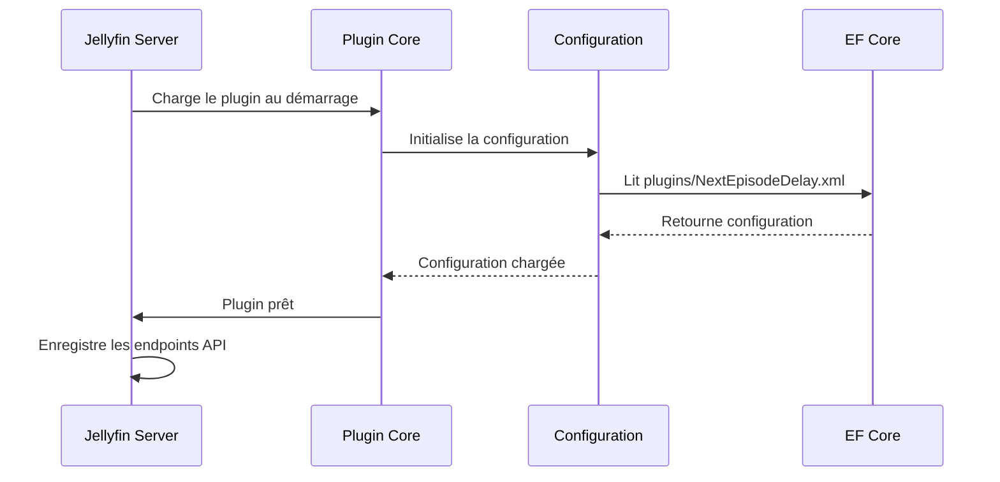
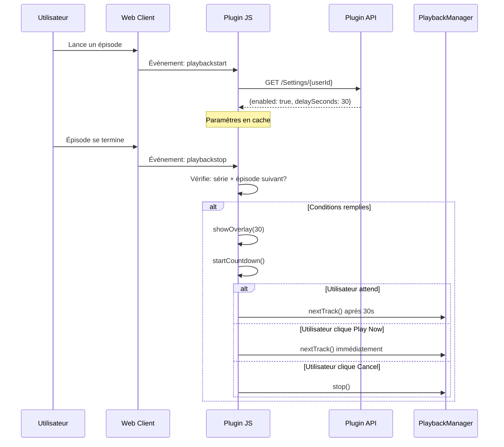
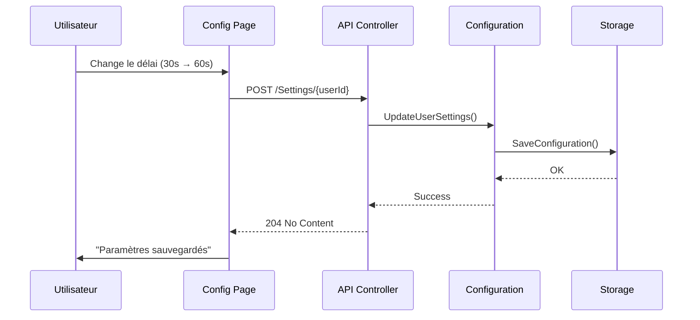

# Architecture du Plugin Next Episode Delay

Ce document décrit l'architecture technique du plugin, son fonctionnement interne et comment les différents composants interagissent.

## Table des matières

1. [Vue d'ensemble](#vue-densemble)
2. [Architecture des composants](#architecture-des-composants)
3. [Flux de données](#flux-de-données)
4. [Composants serveur (C#)](#composants-serveur-c)
5. [Composants client (JavaScript)](#composants-client-javascript)
6. [Communication API](#communication-api)
7. [Persistance des données](#persistance-des-données)
8. [Intégration avec Jellyfin](#intégration-avec-jellyfin)
9. [Patterns et bonnes pratiques](#patterns-et-bonnes-pratiques)

---

## Vue d'ensemble

Le plugin Next Episode Delay est composé de deux parties principales :

```
┌─────────────────────────────────────────────────────────────┐
│                      JELLYFIN SERVER                        │
│                                                             │
│  ┌──────────────────────────────────────────────────────┐  │
│  │          Next Episode Delay Plugin (C#)              │  │
│  │                                                      │  │
│  │  ┌────────────┐  ┌──────────────┐  ┌─────────────┐ │  │
│  │  │   Plugin   │  │     API      │  │  Config     │ │  │
│  │  │    Core    │◄─┤  Controller  │◄─┤  Storage    │ │  │
│  │  └────────────┘  └──────┬───────┘  └─────────────┘ │  │
│  └──────────────────────────┼──────────────────────────┘  │
│                             │ REST API                     │
└─────────────────────────────┼──────────────────────────────┘
                              │
                    ┌─────────▼─────────┐
                    │    HTTP/JSON      │
                    └─────────┬─────────┘
                              │
┌─────────────────────────────▼──────────────────────────────┐
│                      JELLYFIN WEB CLIENT                    │
│                                                             │
│  ┌──────────────────────────────────────────────────────┐  │
│  │      Next Episode Delay Client (JavaScript)          │  │
│  │                                                      │  │
│  │  ┌────────────┐  ┌──────────────┐  ┌─────────────┐ │  │
│  │  │  Playback  │  │   Overlay    │  │    UI       │ │  │
│  │  │   Hooks    │─►│  Manager     │─►│  Component  │ │  │
│  │  └────────────┘  └──────────────┘  └─────────────┘ │  │
│  └──────────────────────────────────────────────────────┘  │
│                                                             │
└─────────────────────────────────────────────────────────────┘
```

---

## Architecture des composants

### Composants Serveur (Backend)

```
Jellyfin.Plugin.NextEpisodeDelay/
│
├── Plugin.cs                           # Point d'entrée principal
│   ├── Hérite de BasePlugin<PluginConfiguration>
│   ├── Gère le cycle de vie du plugin
│   └── Fournit les pages de configuration
│
├── Configuration/
│   ├── PluginConfiguration.cs          # Modèle de données
│   │   ├── DefaultDelaySeconds         # Délai par défaut
│   │   ├── EnabledByDefault            # Activation par défaut
│   │   └── UserSettings Dictionary     # Paramètres par utilisateur
│   │
│   └── configPage.html                 # Interface d'administration
│       ├── Formulaire de configuration
│       ├── Presets rapides
│       └── JavaScript pour API calls
│
└── Api/
    └── NextEpisodeDelayController.cs   # API REST
        ├── GET /Settings/{userId}       # Récupérer paramètres utilisateur
        ├── POST /Settings/{userId}      # Mettre à jour paramètres
        ├── GET /DefaultSettings         # Paramètres par défaut (admin)
        └── POST /DefaultSettings        # Maj paramètres par défaut
```

### Composants Client (Frontend)

```
web/
│
├── nextEpisodeDelay.js                 # Logique principale
│   ├── loadUserSettings()              # Chargement des paramètres
│   ├── initializePlaybackHooks()       # Hook événements Jellyfin
│   ├── showOverlay()                   # Afficher countdown
│   ├── startCountdown()                # Gérer le timer
│   ├── playNow()                       # Skip le délai
│   └── cancelAutoplay()                # Annuler l'autoplay
│
└── nextEpisodeDelay.css                # Styles de l'interface
    ├── .nextEpisodeDelay-overlay       # Conteneur principal
    ├── .nextEpisodeDelay-countdown-*   # Countdown SVG
    └── .nextEpisodeDelay-button-*      # Boutons d'action
```

---

## Flux de données

### 1. Initialisation du plugin



### 2. Lecture d'un épisode



### 3. Modification des paramètres



---

## Composants serveur (C#)

### Plugin.cs

**Responsabilités :**
- Point d'entrée du plugin Jellyfin
- Gestion du cycle de vie
- Exposition des pages de configuration

**Code clé :**
```csharp
public class Plugin : BasePlugin<PluginConfiguration>
{
    public override string Name => "Next Episode Delay";
    public override Guid Id => Guid.Parse("...");

    // Singleton pour accès global
    public static Plugin? Instance { get; private set; }

    // Pages de configuration
    public IEnumerable<PluginPageInfo> GetPages() { ... }
}
```

### PluginConfiguration.cs

**Responsabilités :**
- Modèle de données pour la configuration
- Sérialisation/désérialisation XML
- Validation des valeurs

**Structure :**
```csharp
public class PluginConfiguration : BasePluginConfiguration
{
    public int DefaultDelaySeconds { get; set; }  // 0-300
    public bool EnabledByDefault { get; set; }    // true/false

    // Key: UserId (Guid as string)
    // Value: UserDelaySettings
    public Dictionary<string, UserDelaySettings> UserSettings { get; set; }
}

public class UserDelaySettings
{
    public bool Enabled { get; set; }
    public int DelaySeconds { get; set; }
}
```

**Persistance :**
- Fichier : `/var/lib/jellyfin/config/plugins/Next Episode Delay.xml`
- Format : XML sérialisé automatiquement par Jellyfin
- Sauvegarde : `Plugin.Instance.SaveConfiguration()`

### NextEpisodeDelayController.cs

**Responsabilités :**
- Endpoints API REST
- Validation des requêtes
- Autorisation et permissions

**Endpoints :**

| Méthode | Route | Autorisation | Description |
|---------|-------|--------------|-------------|
| GET | `/NextEpisodeDelay/Settings/{userId}` | DefaultAuthorization | Récupère paramètres utilisateur |
| POST | `/NextEpisodeDelay/Settings/{userId}` | DefaultAuthorization | Met à jour paramètres utilisateur |
| GET | `/NextEpisodeDelay/DefaultSettings` | RequiresElevation | Récupère paramètres par défaut (admin) |
| POST | `/NextEpisodeDelay/DefaultSettings` | RequiresElevation | Met à jour paramètres par défaut (admin) |

**Validation :**
```csharp
[Range(0, 300)]  // Délai entre 0 et 300 secondes
public int DelaySeconds { get; set; }
```

---

## Composants client (JavaScript)

### nextEpisodeDelay.js

**Architecture modulaire :**

```javascript
(function() {
    'use strict';

    // Variables globales du module
    let userSettings = null;
    let countdownInterval = null;
    let overlayElement = null;

    // Fonctions principales
    async function loadUserSettings() { ... }
    function initializePlaybackHooks() { ... }
    function showOverlay(delaySeconds) { ... }
    function startCountdown(totalSeconds) { ... }
    function playNow() { ... }
    function cancelAutoplay() { ... }

    // Point d'entrée
    async function initialize() { ... }

    // Exposition pour debugging
    window.NextEpisodeDelay = { ... };
})();
```

**Événements écoutés :**

| Événement | Source | Action |
|-----------|--------|--------|
| `playbackstop` | Jellyfin PlaybackManager | Détecte fin d'épisode, affiche overlay |
| `click` (Play Now) | Bouton overlay | Lance l'épisode suivant immédiatement |
| `click` (Cancel) | Bouton overlay | Annule l'autoplay |

**Hooks dans Jellyfin :**

```javascript
// Écoute l'événement de fin de lecture
document.addEventListener('playbackstop', async function(event) {
    const state = event.detail?.state;
    const playbackManager = window.playbackManager;

    // Vérifie les conditions
    if (isSeriesEpisode && hasNextEpisode && settingsEnabled) {
        // Empêche l'autoplay par défaut
        event.preventDefault();
        event.stopPropagation();

        // Affiche l'overlay avec délai
        showOverlay(userSettings.DelaySeconds);
    }
});
```

### nextEpisodeDelay.css

**Architecture CSS :**

```css
/* Namespace pour éviter conflits */
.nextEpisodeDelay-* { ... }

/* BEM-like naming */
.nextEpisodeDelay-overlay { }              /* Block */
.nextEpisodeDelay-overlay__content { }     /* Element */
.nextEpisodeDelay-overlay--visible { }     /* Modifier */

/* Responsive */
@media (max-width: 600px) { ... }

/* Animations */
@keyframes pulse { ... }
```

**Compatibilité thème :**
- Utilise `rgba()` pour transparence
- Couleurs compatibles avec thème Jellyfin
- Supporte `prefers-color-scheme`

---

## Communication API

### Format des requêtes

**Authentification :**
```http
GET /NextEpisodeDelay/Settings/123e4567-e89b-12d3-a456-426614174000
Authorization: MediaBrowser Client="Jellyfin Web", Device="...", Token="..."
X-Emby-Authorization: MediaBrowser Client="Jellyfin Web", ...
```

**Body (POST) :**
```json
{
  "enabled": true,
  "delaySeconds": 30
}
```

### Format des réponses

**Succès (200 OK) :**
```json
{
  "enabled": true,
  "delaySeconds": 30
}
```

**Succès sans contenu (204 No Content) :**
```http
HTTP/1.1 204 No Content
```

**Erreur (404 Not Found) :**
```json
{
  "error": "Plugin not initialized"
}
```

**Erreur de validation (400 Bad Request) :**
```json
{
  "type": "https://tools.ietf.org/html/rfc7231#section-6.5.1",
  "title": "One or more validation errors occurred.",
  "status": 400,
  "errors": {
    "DelaySeconds": ["The field DelaySeconds must be between 0 and 300."]
  }
}
```

---

## Persistance des données

### Structure XML

```xml
<?xml version="1.0" encoding="utf-8"?>
<PluginConfiguration xmlns:xsi="http://www.w3.org/2001/XMLSchema-instance">
  <DefaultDelaySeconds>30</DefaultDelaySeconds>
  <EnabledByDefault>true</EnabledByDefault>
  <UserSettings>
    <entry>
      <key>123e4567-e89b-12d3-a456-426614174000</key>
      <value>
        <Enabled>true</Enabled>
        <DelaySeconds>60</DelaySeconds>
      </value>
    </entry>
  </UserSettings>
</PluginConfiguration>
```

### Emplacement des fichiers

| Plateforme | Chemin de configuration |
|------------|------------------------|
| Linux | `/var/lib/jellyfin/config/plugins/Next Episode Delay.xml` |
| Docker | `/config/plugins/Next Episode Delay.xml` |
| Windows | `C:\ProgramData\Jellyfin\Server\config\plugins\Next Episode Delay.xml` |

### Migrations

Actuellement : **Aucune migration nécessaire** (v1.0.0)

Future versions :
- Migration de configuration si changement de structure
- Script de migration fourni avec le plugin

---

## Intégration avec Jellyfin

### Points d'extension utilisés

1. **BasePlugin<T>**
   - Cycle de vie du plugin
   - Configuration persistence
   - Pages de configuration

2. **IHasWebPages**
   - Injection de pages HTML dans le dashboard
   - Configuration interface

3. **API Controllers**
   - Routes API personnalisées
   - Autorisation Jellyfin
   - Validation automatique

4. **Embedded Resources**
   - JavaScript/CSS embarqués dans la DLL
   - Chargement automatique par Jellyfin Web

### Événements Jellyfin

| Événement | Source | Utilisé pour |
|-----------|--------|--------------|
| `playbackstop` | PlaybackManager | Détecter fin de lecture |
| `playbackstart` | PlaybackManager | (Futur) Précharger paramètres |

### API Jellyfin utilisées

```javascript
// Récupérer l'ID utilisateur
window.ApiClient.getCurrentUserId()

// Effectuer des requêtes authentifiées
window.ApiClient.getAuthorizationHeader()

// Accès au gestionnaire de lecture
window.playbackManager.nextTrack()
window.playbackManager.stop()
```

---

## Patterns et bonnes pratiques

### Design Patterns

1. **Singleton (Plugin.cs)**
   ```csharp
   public static Plugin? Instance { get; private set; }
   ```
   - Accès global à la configuration
   - Un seul point d'entrée

2. **Module Pattern (nextEpisodeDelay.js)**
   ```javascript
   (function() {
       // Variables privées
       let userSettings = null;

       // API publique
       window.NextEpisodeDelay = { ... };
   })();
   ```
   - Encapsulation
   - Pas de pollution du scope global

3. **Repository Pattern (Configuration)**
   - Configuration = Repository de données
   - Abstraction de la persistance

### Bonnes pratiques appliquées

#### Serveur (C#)

- ✅ Nullable reference types activé
- ✅ Documentation XML complète
- ✅ Validation des entrées avec DataAnnotations
- ✅ Gestion d'erreurs appropriée
- ✅ Code asynchrone avec async/await
- ✅ Conventions de nommage C#

#### Client (JavaScript)

- ✅ ES6+ features (const, let, arrow functions)
- ✅ Async/await pour promesses
- ✅ Event delegation
- ✅ Debouncing/throttling si nécessaire
- ✅ Namespacing avec préfixe CSS

#### Sécurité

- ✅ Autorisation sur tous les endpoints
- ✅ Validation côté serveur
- ✅ Pas de données sensibles exposées
- ✅ CSRF protection (Jellyfin built-in)
- ✅ XSS prevention (sanitization)

#### Performance

- ✅ Cache des paramètres utilisateur côté client
- ✅ Embedded resources (pas de HTTP calls supplémentaires)
- ✅ Lazy loading de l'overlay
- ✅ Cleanup des intervalles/timers
- ✅ CSS transitions pour animations fluides

---

## Extension et personnalisation

### Ajouter un nouveau paramètre

**1. Backend (Configuration) :**
```csharp
public class PluginConfiguration
{
    public bool PlaySoundOnDelay { get; set; }  // Nouveau paramètre
}
```

**2. Backend (API) :**
```csharp
public class UserDelaySettingsResponse
{
    public bool PlaySound { get; set; }  // Exposer via API
}
```

**3. Frontend (HTML) :**
```html
<input type="checkbox" id="playSound" />
```

**4. Frontend (JavaScript) :**
```javascript
const config = {
    EnabledByDefault: ...,
    PlaySound: document.querySelector('#playSound').checked
};
```

### Ajouter une nouvelle action

**1. Nouveau bouton dans l'overlay :**
```javascript
const newButton = `
    <button class="nextEpisodeDelay-button" id="skipIntro">
        <span>Skip Intro</span>
    </button>
`;
```

**2. Handler d'événement :**
```javascript
document.getElementById('skipIntro')
    .addEventListener('click', skipIntro);

function skipIntro() {
    // Logique de skip d'intro
    playbackManager.seek(90000); // 90s
    playNow();
}
```

---

## Diagrammes supplémentaires

### Architecture en couches

```
┌─────────────────────────────────────────┐
│         Presentation Layer              │
│   (HTML/CSS/JS - User Interface)        │
└────────────────┬────────────────────────┘
                 │
┌────────────────▼────────────────────────┐
│         Application Layer               │
│    (API Controllers - Business Logic)   │
└────────────────┬────────────────────────┘
                 │
┌────────────────▼────────────────────────┐
│         Domain Layer                    │
│  (Configuration Models - Core Logic)    │
└────────────────┬────────────────────────┘
                 │
┌────────────────▼────────────────────────┐
│         Infrastructure Layer            │
│   (XML Persistence - Data Storage)      │
└─────────────────────────────────────────┘
```

---

## Références

- [Jellyfin Plugin Development](https://jellyfin.org/docs/general/server/plugins/)
- [Jellyfin API Documentation](https://api.jellyfin.org/)
- [.NET 9.0 Documentation](https://docs.microsoft.com/en-us/dotnet/)
- [MDN Web Docs (JavaScript)](https://developer.mozilla.org/)

---

**Document mis à jour :** 2026-02-08
**Version du plugin :** 1.0.0
